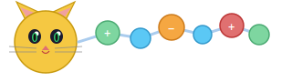

# cgkitten



Convert mmCIF/PDB protein structures to a coarse-grained representation.

Two coarse-graining policies are available:

- **multi** (default): Each amino acid becomes one bead at its centre of mass.
  Titratable residues (ASP, GLU, HIS, CYS, TYR, LYS, ARG) get an additional bead
  at the charge centre.
- **single**: Each amino acid becomes exactly one bead. Titratable residues get
  unique numbered type names (ASP1, ASP2, ...) to carry distinct charges.

N- and C-terminal charges are always included as separate beads in both policies.
Water and non-protein molecules are removed; coordinated metal ions are retained.
Multi-chain structures are fully supported with per-chain terminal beads.

Charges are computed using Metropolis Monte Carlo titration (default, 10 000 sweeps)
with screened Coulomb (Yukawa) electrostatics. Use `--mc 0` for Henderson-Hasselbalch only.

## Install

```bash
cargo install --git https://github.com/mlund/cgkitten
```

## Usage

Shared flags (`input`, `--temperature`, `--ionic-strength`, `--mc`, `--cg`, `--chain`) are
placed before the subcommand. Convert-specific flags (`--ph`, `--top`, `--model`,
`--scale-hydrophobic`, `--merge-tol`) follow the `convert` subcommand.

```bash
# Convert at pH 7 with MC titration (default: 10000 sweeps)
# Saves both structure.pqr and structure.xyz by default
cgkitten structure.cif convert

# Explicit output file (single format)
cgkitten structure.cif convert -o output.pqr

# Single-bead coarse-graining (one bead per residue)
cgkitten structure.cif --cg single convert --top topology.yaml

# Henderson-Hasselbalch only (no MC)
cgkitten structure.cif --mc 0 convert

# Custom pH and sweeps
cgkitten structure.cif --mc 50000 convert --ph 4.5

# Pipe from stdin (saves output.pqr and output.xyz)
cat structure.cif | cgkitten convert

# Single format output
cgkitten structure.cif convert -o output.xyz

# Scale hydrophobic pair interactions (λ increased by 20%)
cgkitten structure.cif convert --scale-hydrophobic lambda:1.2

# Scale hydrophobic ε instead
cgkitten structure.cif convert --scale-hydrophobic epsilon:0.8

# Custom charge-merging tolerance (default 0.02)
cgkitten structure.cif convert --merge-tol 0.05

# Custom conditions
cgkitten structure.cif --temperature 310 --ionic-strength 0.15 convert --ph 4.5

# Select specific chains (default: all chains)
cgkitten structure.cif --chain A convert
cgkitten structure.cif --chain A --chain B convert

# pH scan with terminal plot
cgkitten structure.cif scan

# pH scan with single-bead policy
cgkitten structure.cif --cg single scan

# pH scan with HH only
cgkitten structure.cif --mc 0 scan

# pH scan with custom range and save to file
cgkitten structure.cif scan --ph-start 2 --ph-end 12 --ph-step 0.25 -o curve.dat
```

## Monte Carlo titration

Charges are computed using Metropolis Monte Carlo titration by default
(`--mc 10000`), which captures many-body electrostatic coupling between
titratable sites. Use `--mc 0` for the instantaneous Henderson-Hasselbalch
independent-site approximation.

### Method

1. **Initialization**: Protonation states are set from Henderson-Hasselbalch
   at the given pH, providing a physically reasonable starting configuration.

2. **Yukawa electrostatics**: Pairwise interactions use a screened Coulomb
   (Yukawa) potential:

   U/kT = λ\_B · q\_i · Σ\_j z\_j · exp(−r\_ij / λ\_D) / r\_ij

   where λ\_B is the Bjerrum length (~7.1 Å at 298 K in water) and λ\_D is
   the Debye screening length (~9.6 Å at 0.1 M ionic strength). The kernel
   exp(−r/λ\_D)/r is precomputed once for all bead pairs.

3. **Metropolis sweeps**: Each sweep proposes N random protonation state
   changes (one per titratable site on average). A trial move toggles a
   site's protonation and is accepted with probability:

   P = min(1, exp(−ΔU/kT))

   where ΔU/kT = Δq · φ\_i ± ln(10) · (pH − pKa), with φ\_i being the
   electrostatic potential at site i from all other titratable sites plus
   a constant background from fixed-charge beads (metal ions).

4. **Ensemble averages**: The mean charge ⟨Z⟩, ⟨Z²⟩, dipole moment ⟨μ⟩,
   and ⟨μ²⟩ are accumulated over all sweeps as true ensemble averages.

## Hydrophobic pair scaling

The `--scale-hydrophobic` flag generates pairwise nonbonded overrides in the
topology for all hydrophobic residue pairs (ALA, ILE, LEU, MET, PHE, PRO, TRP,
TYR, VAL). This is useful for modelling temperature-dependent hydrophobic
effects without changing the global default interaction.

Parameters are mixed using Lorentz-Berthelot combining rules (arithmetic mean
for σ and λ, geometric mean for ε), then the chosen quantity is scaled:

- `lambda:<factor>` — scale the Ashbaugh-Hatch hydrophobicity λ
- `epsilon:<factor>` — scale the Lennard-Jones well depth ε

The resulting `[TypeA, TypeB]:` pair entries appear under `nonbonded:` in the
topology YAML, overriding the `default:` mixing rule for those specific pairs.

## Topology output

The topology YAML (`topology.yaml` by default, override with `--top`) contains
atom types with charge, mass, σ, ε, and λ. Titratable site types with similar
charges (within `--merge-tol`, default 2%) are merged into a single type using
their mean charge. The file header records the exact command used to generate it
for reproducibility.

## pH scan

The `scan` subcommand plots average net charge ⟨Z⟩ as a function of pH in
the terminal. Henderson-Hasselbalch is always shown; when MC is enabled
(the default), the Monte Carlo result is overlaid in a different color.
MC pH points are computed in parallel using rayon.

With `-o`, scan data is saved to a space-separated file with columns:

```
# pH Z(HH) Z2(HH) mu(HH) mu2(HH) [Z(MC) Z2(MC) mu(MC) mu2(MC)]
```

where Z is net charge, Z2 is ⟨Z²⟩, mu is dipole moment ⟨μ⟩ (e·Å), and
mu2 is ⟨μ²⟩. MC columns are included when `--mc` > 0.

## Library usage

```rust
use cgkitten::{ChargeCalc, coarse_grain, coarse_grain_with, SingleBead};

let cif_data = std::fs::read("structure.cif").unwrap();

// Multi-bead (default)
let beads = coarse_grain(cif_data.as_slice());

// Single-bead policy
let beads = coarse_grain_with(cif_data.as_slice(), &SingleBead);

// Henderson-Hasselbalch (default)
let result = ChargeCalc::new().ph(7.4).run(&beads);
println!("⟨Z⟩ = {:.2}, ⟨μ⟩ = {:.1} e·Å", result.multipole.charge, result.multipole.dipole);

// Monte Carlo titration
let result = ChargeCalc::new().ph(7.4).mc(10000).run(&beads);
let charged_beads = result.apply(&beads);

// Serde support (with "serde" feature)
// let calc: ChargeCalc = serde_json::from_str(r#"{"ph": 7.4, "mc": 10000}"#)?;
```

## License

Apache-2.0
