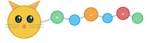

# cgkitten



Convert mmCIF/PDB protein structures to a coarse-grained representation.

## Installation

```bash
cargo install --git https://github.com/mlund/cgkitten
```

## Quick start

```bash
# Convert structure at pH 7 (default) with MC titration
cgkitten structure.cif convert

# Generate topology file alongside the structure
cgkitten structure.cif convert --top topology.yaml

# pH titration scan with terminal plot
cgkitten structure.cif scan
```

## Coarse-graining policies

Two policies are available via `--cg` (default: `multi`):

- **multi**: Each amino acid becomes one bead at its centre of mass.
  Titratable residues (ASP, GLU, HIS, CYS, TYR, LYS, ARG) get an additional bead
  at the charge centre.
- **single**: Each amino acid becomes exactly one bead. Titratable residues get
  unique numbered type names (ASP1, ASP2, ...) to carry distinct charges.

N- and C-terminal charges are always included as separate beads.
Water and non-protein molecules are removed; coordinated metal ions are retained.
Multi-chain structures are fully supported with per-chain terminal beads.

## Convert

The `convert` subcommand writes coarse-grained structure and topology files.
Shared flags are placed before `convert`; convert-specific flags follow it.

```bash
# Explicit output file (single format)
cgkitten structure.cif convert -o output.pqr

# Single-bead coarse-graining
cgkitten structure.cif --cg single convert --top topology.yaml

# Custom pH and MC sweeps
cgkitten structure.cif --mc 50000 convert --ph 4.5

# Henderson-Hasselbalch only (no MC)
cgkitten structure.cif --mc 0 convert

# Pipe from stdin
cat structure.cif | cgkitten convert

# Custom conditions
cgkitten structure.cif --temperature 310 --ionic-strength 0.15 convert --ph 4.5

# Select specific chains
cgkitten structure.cif --chain A convert
cgkitten structure.cif --chain A --chain B convert
```

### Output formats

By default, both `.pqr` and `.xyz` files are written. Use `-o` to write a single format:

```bash
cgkitten structure.cif convert -o output.pqr
cgkitten structure.cif convert -o output.xyz
```

### Force field models

The `--model` flag selects the coarse-grained force field (default: `calvados3`).
Use `--model none` to skip force field parameters entirely.

| Model | Potential | Pair section | Reference |
|-------|-----------|--------------|-----------|
| `calvados3` | Ashbaugh-Hatch | `replace:` | [doi:10.1093/database/baz024](https://doi.org/10.1093/database/baz024) |
| `kimhummer` / `kh` | Kim-Hummer | `replace:`/`append:` | [doi:10.1016/j.jmb.2007.11.063](https://doi.org/10.1016/j.jmb.2007.11.063) |
| `pasquier` | Lennard-Jones | `replace:`/`append:` | [doi:10.1016/j.jcis.2022.08.054](https://doi.org/10.1016/j.jcis.2022.08.054) |

```bash
cgkitten structure.cif convert --model kimhummer
```

**Pasquier**: LJ interactions using Kim-Hummer sigma values and two epsilon classes
(open conformation): epsilon_hh = 0.485 kT for hydrophobic-hydrophobic pairs,
epsilon = 0.005 kT for all other pairs.

### Hydrophobic scaling

The `--scale-hydrophobic` flag generates pairwise nonbonded overrides for
hydrophobic residue pairs (ALA, ILE, LEU, MET, PHE, PRO, TRP, TYR, VAL):

- `lambda:<factor>` -- scale Ashbaugh-Hatch lambda (Calvados 3 only)
- `epsilon:<factor>` -- scale well depth epsilon (all models)

```bash
# Scale lambda by 20% (Calvados 3)
cgkitten structure.cif convert --scale-hydrophobic lambda:1.2

# Scale epsilon (works for all models)
cgkitten structure.cif convert --scale-hydrophobic epsilon:0.8
cgkitten structure.cif convert --model kh --scale-hydrophobic epsilon:0.8
```

For Calvados 3, parameters are mixed using Lorentz-Berthelot combining rules
(arithmetic mean for sigma and lambda, geometric mean for epsilon), then the chosen
quantity is scaled.

For Kim-Hummer and Pasquier, pairs are partitioned by charge: neutral under
`replace:` (skips redundant Coulomb), charged under `append:` (inherits Coulomb
from default).

### Topology output

The topology YAML (`topology.yaml` by default, override with `--top`) contains
atom types with charge, mass, and force-field-specific fields. Titratable site
types with similar charges (within `--merge-tol`, default 2%) are merged into a
single type using their mean charge. The file header records the exact command
for reproducibility.

```bash
# Custom charge-merging tolerance
cgkitten structure.cif convert --merge-tol 0.05
```

## pH scan

The `scan` subcommand plots average net charge as a function of pH in the terminal.
Henderson-Hasselbalch is always shown; when MC is enabled (the default), the
Monte Carlo result is overlaid in a different color. MC pH points are computed
in parallel using rayon.

```bash
# Terminal plot
cgkitten structure.cif scan

# Single-bead policy
cgkitten structure.cif --cg single scan

# Henderson-Hasselbalch only
cgkitten structure.cif --mc 0 scan

# Custom range and save to file
cgkitten structure.cif scan --ph-start 2 --ph-end 12 --ph-step 0.25 -o curve.dat
```

With `-o`, scan data is saved to a space-separated file with columns:

```
# pH Z(HH) Z2(HH) mu(HH) mu2(HH) [Z(MC) Z2(MC) mu(MC) mu2(MC)]
```

where Z is net charge, Z2 is the second moment, mu is dipole moment (e*A), and
mu2 is the dipole second moment. MC columns are included when `--mc` > 0.

## Shared flags

| Flag | Default | Description |
|------|---------|-------------|
| `--temperature` | 298 | Temperature in Kelvin |
| `--ionic-strength` | 0.1 | Ionic strength in mol/L |
| `--mc` | 10000 | Number of MC titration sweeps (0 = Henderson-Hasselbalch only) |
| `--cg` | `multi` | Coarse-graining policy (`multi` or `single`) |
| `--chain` | all | Select specific chain(s); repeat for multiple |

## Monte Carlo titration

Charges are computed using Metropolis Monte Carlo titration by default
(`--mc 10000`), which captures many-body electrostatic coupling between
titratable sites. Use `--mc 0` for the instantaneous Henderson-Hasselbalch
independent-site approximation.

### Method

1. **Initialization**: Protonation states are set from Henderson-Hasselbalch
   at the given pH, providing a physically reasonable starting configuration.

2. **Yukawa electrostatics**: Pairwise interactions use a screened Coulomb
   (Yukawa) potential:

   U/kT = lambda_B * q_i * sum_j z_j * exp(-r_ij / lambda_D) / r_ij

   where lambda_B is the Bjerrum length (~7.1 A at 298 K in water) and lambda_D is
   the Debye screening length (~9.6 A at 0.1 M ionic strength). The kernel
   exp(-r/lambda_D)/r is precomputed once for all bead pairs.

3. **Metropolis sweeps**: Each sweep proposes N random protonation state
   changes (one per titratable site on average). A trial move toggles a
   site's protonation and is accepted with probability:

   P = min(1, exp(-dU/kT))

   where dU/kT = dq * phi_i +/- ln(10) * (pH - pKa), with phi_i being the
   electrostatic potential at site i from all other titratable sites plus
   a constant background from fixed-charge beads (metal ions).

4. **Ensemble averages**: The mean charge, its second moment, dipole moment,
   and its second moment are accumulated over all sweeps as true ensemble averages.

## Library usage

```rust
use cgkitten::{ChargeCalc, coarse_grain, coarse_grain_with, SingleBead};

let cif_data = std::fs::read("structure.cif").unwrap();

// Multi-bead (default)
let beads = coarse_grain(cif_data.as_slice());

// Single-bead policy
let beads = coarse_grain_with(cif_data.as_slice(), &SingleBead);

// Henderson-Hasselbalch (default)
let result = ChargeCalc::new().ph(7.4).run(&beads);
println!("Z = {:.2}, mu = {:.1} e*A", result.multipole.charge, result.multipole.dipole);

// Monte Carlo titration
let result = ChargeCalc::new().ph(7.4).mc(10000).run(&beads);
let charged_beads = result.apply(&beads);

// Serde support (with "serde" feature)
// let calc: ChargeCalc = serde_json::from_str(r#"{"ph": 7.4, "mc": 10000}"#)?;
```

## License

Apache-2.0
